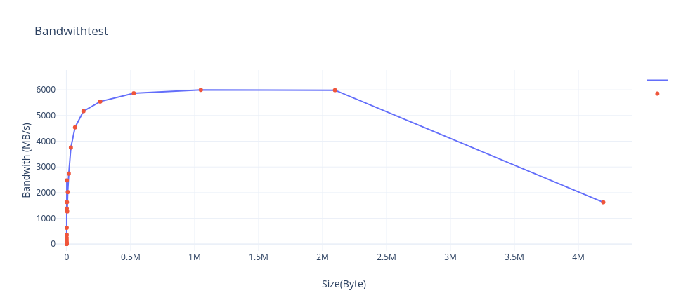
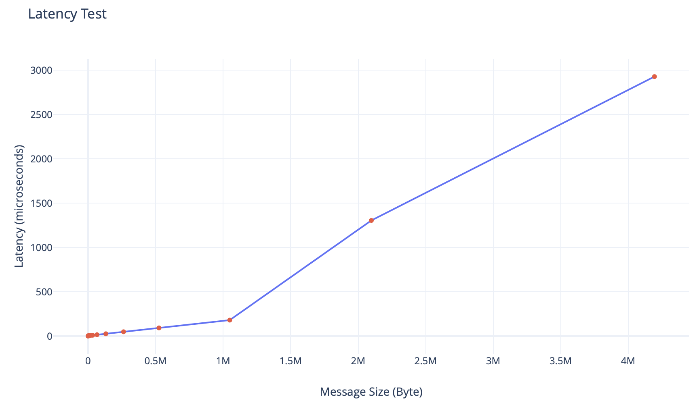
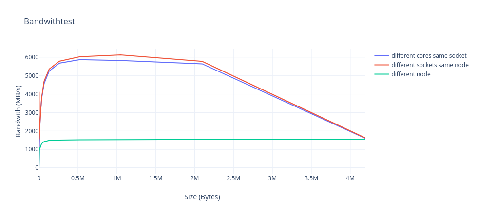
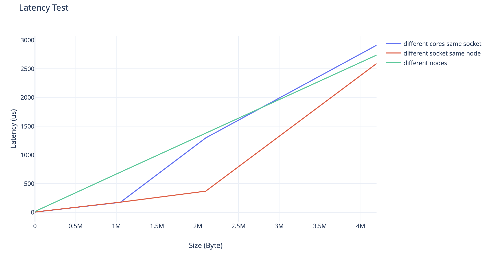
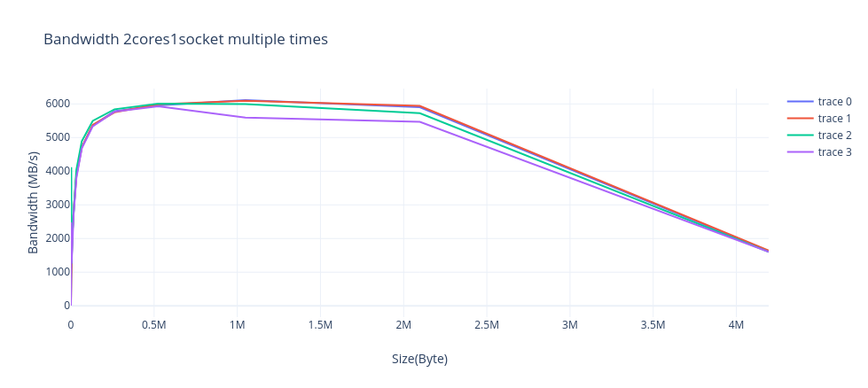
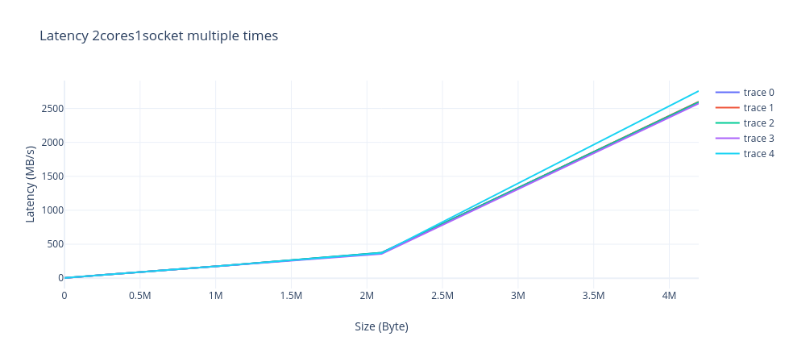

# Assignment 1, due October 19th 2020
Handl Philip, Buchauer Manuel, De Sclavis Davide

## Exercise 1

### Tasks
#### Study how to submit jobs in SGE, how to check their state and how to cancel them.

- <code>qsub name_of_script</code> is used to submit jobs where name_of_script represents the path to  a simple shell script containing the commands to be run on the remote cluster nodes.
For instance if a script called `save_the_world.sh` should be executed the following command has to be ran: <code>qsub save_the_world.sh</code> 
- <code>qstat</code> to get information about running or waiting jobs, e.g. when the job was started, its current state, its ID or its name.  
- <code>qdel job-id</code> to delete a running job. This terminates the job and frees up acquired resources.

#### Prepare a submission script that starts an arbitrary executable, e.g. `/bin/hostname`
You can find this code also in the file: `save_the_world.sh`

<pre><code>#!/bin/bash

#$ -q std.q
#$ -cwd
#$ -N world_saviors
#$ -o output.dat
#$ -j yes
#$ -pe openmpi-2perhost 8

echo "We are going to save the world!"

module load openmpi/3.1.1
mpiexec -n 8 /bin/hostname

echo "...ok, or at least to execute /bin/hostname"

</code></pre>

After running this script an output similar to the following one should be found in `output.dat`:

<pre>
We are going to save the world!
  Loading openmpi/3.1.1 for compiler gnu-4.8.5
n002.intern.lcc2
n002.intern.lcc2
n004.intern.lcc2
n005.intern.lcc2
n003.intern.lcc2
n004.intern.lcc2
n005.intern.lcc2
n003.intern.lcc2
...ok, or at least to execute /bin/hostname
</pre>

#### In your opionion, what are the 5 most important parameters available when submitting a job and why? What are possible settings of these parameters, and what effect do they have?
1. <code>-q queuename</code>: This parameter is used to submit a job to a specific queue. All available queues can be shown by running `qconf -sql`. The default queue that is used if this parameter is not explicitly set is `std.q`.
2. <code>-pe parallel-env num-of-slots</code>: With the help of `-pe` it is possible to define a parallel environment (`parallel-env`) which is MPI in our case and how many slots should be reserved (`num-of-slots`). It is important to mention that the cores are just reserved for the job and the program has to make sure on its own that they are really used. If this parameter is left out the job is executed sequentially.
3. <code>-N jobname</code>: In the default case the filename of the script is also the jobname. With `-N` it is possible to rename it to maybe something more expressive.
4. <code>-w e|w|n|p|v</code>: This parameter can be used to validate a submission script. If `-w` is used in combination with `e` it is rejected if errors are found, `w` outputs only a warning but won't reject the whole script, `n` turns off the validation, `p` stands for poke and prints a validation report and `v` does only the verification but does not submit the job.  
5. <code>-cwd</code>: to execute job in current working directory. If this option is omitted, the job will executed in $HOME, however, usually we want to execute it in the current directory since input & output file names are relative to this directory.

A sample application of those parameters if they are set in the submission script is given below:
<pre><code>
#$ -q std.q
#$ -pe openmpi-2perhost 8
#$ -N world_saviors
#$ -w p
#$ -cwd
</code></pre>

#### How do you run your program in parallel? What environment setup is required?
In order to run a program in parallel multiple nodes must be available where a message passing library like openmpi 
can be run. With the parameter `-pe` a parallel environment can be configured. In our case we can define
something like `-pe openmpi-Xperhost Y`. This means that `X` slots per node are reserved and in total `Y` slots are
acquired. As a result `Y` has to be a multiple of `X`.

With the line  <code>#$ -pe openmpi-2perhost 8 </code>in the job script a parallel environment is set up.  
This sets up a parallel environment with 2 CPU/cores per node and in total 8 cores. So in total 4 nodes with 2 cores each are needed to get to the 8 cores in total. 

To actually start the program in parallel, the  `mpiexec -n 8 /path/to/application` command is needed. 
The `-n` flag is set to 8, which executes the command/program 8 times (i.e. starts 8 processes).

## Exercise 2

This exercise consists in running an MPI microbenchmark in order to examine the impact of HPC topologies on performance.

### Tasks

#### Download and build the OSU Micro-Benchmarks

- First of all we created a new folder with the name benchmark. 
- Then we downloaded the benchmark with:
<code>wget http://mvapich.cse.ohio-state.edu/download/mvapich/osu-micro-benchmarks-5.6.2.tar.gz</code>
- Then we unzipped the folder using: <code>tar -zxvf osu-micro-benchmarks-5.6.2.tar.gz</code> 
- Afterward we loaded openmpi: <code>module load openmpi/3.1.1 </code> 
- <code> ./configure CC=mpicc CXX=mpic++ </code>
- <code> make </code>

For preparing this task, as we did, the following script can be run: prepare_task2.sh

#### After building, submit SGE jobs that run the `osu_latency` and `osu_bw` executables.
For submitting the jobs we used the job.script in the benchmark directory one time with the `osu_latency` and one time 
with the `osu_bw`. Both were running on 2 CPUs/cores per node with 2 cores in total which we demanded with the command 
`openmpi-2perhost 2`. And with `mpiexec -n 2` we started the two processes.

#### Create a table and figures that illustrate the measured data and study them. What effects can you observe?

Running those two programs results in the following table.
<table>
<tr><th>OSU MPI Bandwidth Test v5.6.2 </th><th># OSU MPI Latency Test v5.6.2</th></tr>
<tr><td>

|Size                       |Bandwidth (MB/s)           |
|---------------------------|---------------------------|
|1                          |4.94                       |   
|2                          |10.04                      |
|4                          |19.96                      |
|8                          |40.00                      |
|16                         |70.79                      |
|32                         |151.79                     |
|64                         |242.80                     |
|128                        |364.50                     |
|256                        |633.70                     |
|512                        |1381.90                    |
|1024                       |2477.48                    |
|2048                       |1629.83                    |
|4096                       |1268.76                    |
|8192                       |2020.97                    |
|16384                      |2741.08                    |
|32768                      |3753.49                    |
|65536                      |4539.52                    |
|131072                     |5168.45                    |
|262144                     |5544.02                    |
|524288                     |5864.61                    |
|1048576                    |5996.34                    |
|2097152                    |5983.98                    |
|4194304                    |1626.61                    |

</td><td>

| Size                      | Latency (us)              | 
|---------------------------|---------------------------|
|0                          |0.54                       |
|1                          |0.61                       |
|2                          |0.60                       |
|4                          |0.69                       |
|8                          |0.69                       |
|16                         |0.80                       |
|32                         |0.81                       |
|64                         |0.83                       |
|128                        |1.07                       |
|256                        |1.31                       |
|512                        |0.87                       |
|1024                       |1.98                       |
|2048                       |4.62                       |
|4096                       |4.96                       |
|8192                       |5.90                       |
|16384                      |6.61                       |
|32768                      |9.38                       |
|131072                     |25.91                      |
|65536                      |14.98                      |
|262144                     |48.33                      |
|524288                     |91.88                      |
|1048576                    |179.93                     |
|2097152                    |1304.18                    |
|4194304                    |2927.11                    |

</td></tr> </table>

 
The graphic from above shows the bandwith benchmark for 2 CPUs/cores per node. On short message sizes up to 1024 Bytes we see an increase in the Bandwith up to around 2500 MB/s. After a short dip in bandwidth performance at a message size of 2048 - 4096 Bytes, the bandwidth increases up to nearly 6000 MB/s. At a message Size of around 4 MB the bandwidth drops down to 1600 MB/s.   

 
As it can be seen in the visualization of the resulting table, the latency increases continuently. However what also can be observed is that the latency growth is steeper when the message size gets above about 1,3 Mb.

#### Modify your experiment such that the 2 MPI ranks are placed on
- different cores of the same socket,
- different sockets of the same node, and
- different nodes.

For this we have created several `.script` files that are running the benchmarks:
* bandwidth_2_cores
* bandwidth_2_cores_1_socket.script
* bandwidth_2_nodes.script
* latency_2_cores.script
* latency_2_cores_1_socket.script
* latency_2_nodes.script

Those scripts were executed in the folder `benchmark_test/osu-micro-benchmarks-5.6.2/`.

#### Amend your table and figures to include these additional measurements.

| Size    | Bandwith(Mb/s) - 2cores1socket | Bandwith(Mb/s) - 2sockets | Bandwith(Mb/s) - 2nodes |
|---------|--------------------------------|---------------------------|-------------------------|
| 1       | 5.00                           | 4.97                      | 0.63                    |
| 2       | 10.19                          | 10.09                     | 1.26                    |
| 4       | 20.25                          | 20.05                     | 2.52                    |
| 8       | 40.35                          | 40.14                     | 5.10                    |
| 16      | 72.06                          | 67.80                     | 10.24                   |
| 32      | 153.55                         | 132.69                    | 20.47                   |
| 64      | 239.43                         | 165.41                    | 40.73                   |
| 128     | 362.78                         | 176.18                    | 77.89                   |
| 256     | 422.67                         | 288.17                    | 153.87                  |
| 512     | 443.74                         | 440.33                    | 294.43                  |
| 1024    | 609.24                         | 1735.72                   | 530.55                  |
| 2048    | 796.88                         | 4128.30                   | 749.30                  |
| 4096    | 1248.92                        | 1550.88                   | 925.43                  |
| 8192    | 1992.62                        | 2107.21                   | 1065.01                 |
| 16384   | 2737.31                        | 2760.04                   | 1110.87                 |
| 32768   | 3730.61                        | 3790.33                   | 1307.54                 |
| 65536   | 4575.70                        | 4703.92                   | 1423.68                 |
| 131072  | 5251.93                        | 5357.46                   | 1484.86                 |
| 262144  | 5676.90                        | 5783.70                   | 1505.98                 |
| 524288  | 5869.10                        | 6025.64                   | 1522.19                 |
| 1048576 | 5820.31                        | 6128.82                   | 1531.39                 |
| 2097152 | 5640.94                        | 5775.67                   | 1538.05                 |
| 4194304 | 1597.51                        | 1620.67                   | 1540.66                 |

| Size    | Latency(us) - 2cores1socket | Latency(us) - 2sockets | Latency(us) - 2nodes |
|---------|-----------------------------|------------------------|----------------------|
| 0       | 0.41                        | 0.40                   | 3.48                 |
| 1       | 0.45                        | 0.45                   | 3.55                 |
| 2       | 0.45                        | 0.45                   | 3.55                 |
| 4       | 0.62                        | 0.45                   | 3.55                 |
| 8       | 0.69                        | 0.60                   | 3.60                 |
| 16      | 0.80                        | 0.80                   | 3.63                 |
| 32      | 0.80                        | 0.80                   | 3.66                 |
| 64      | 0.83                        | 0.83                   | 3.85                 |
| 128     | 1.07                        | 1.07                   | 4.83                 |
| 256     | 1.31                        | 1.31                   | 5.33                 |
| 512     | 2.09                        | 2.04                   | 6.12                 |
| 1024    | 3.00                        | 2.99                   | 7.40                 |
| 2048    | 4.58                        | 4.69                   | 9.79                 |
| 4096    | 4.90                        | 4.84                   | 12.62                |
| 8192    | 5.72                        | 5.75                   | 18.49                |
| 16384   | 7.46                        | 7.63                   | 26.36                |
| 32768   | 10.17                       | 10.31                  | 36.81                |
| 65536   | 15.71                       | 15.85                  | 57.82                |
| 131072  | 25.57                       | 26.49                  | 100.64               |
| 262144  | 46.92                       | 47.51                  | 187.56               |
| 524288  | 89.56                       | 90.24                  | 357.62               |
| 1048576 | 174.27                      | 176.54                 | 698.49               |
| 2097152 | 1295.37                     | 368.46                 | 1378.13              |
| 4194304 | 2908.69                     | 2589.86                | 2737.34              |

#### What effects can you observe? How can you verify rank placement without looking at performance?
As expected the latency between two cores of the same node is smaller than between two nodes. The bandwith in opposite, is bigger with two cores of the same node than with two seperate nodes. However, both the bandwith and the latency of two cores of the same node, approach the values of two separate nodes the bigger the message size gets. What also can be observed is that values of same socket and different sockets are nearly the same both for the bandwith and the latency.

 
  

#### How stable are the measurements when running the experiments multiple times?

 
  
