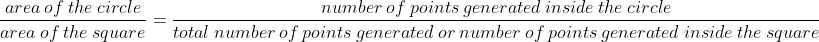
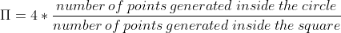

# Assignment 2, due November 9th 2020
Buchauer Manuel, De Sclavis Davide, Handl Philip 

## Exercise 1

This exercise consists in writing a parallel application to speed up the computation of π.

### Description

There are many ways of approximating π, one being a well-known Monte Carlo method: The ratio of the areas of a square and its incircle is π/4. Since the exact area of a circle cannot be computed (we don't know the value of π yet), one can instead sample random points, check their distance from the center and compute the ratio of points inside the circle to all sampled points.

### Tasks

####  1) Write a sequential application `pi_seq` in C or C++ that computes π for a given number of samples (command line argument). Test your application for various, large sample sizes to verify the correctness of your implementation.
We know that area of the square is 1 and the area of the circle is π/4.
Now for a very large number of randomly created generated points we have:

 

and therefore we get:

 

| Samples                   | π (1)    | π (2)    | π (3)    | π (4)    | π (5)    | π (avg)    |      
|---------------------------|----------|----------|----------|----------|----------|------------|
|100                        |3.16      |3.2       |3.12      |3.16      |3.24      |3.176       |
|1000                       |3.208     |3.148     |3.148     |3.136     |3.068     |3.1416      |
|10000                      |3.15      |3.1208    |3.1168    |3.1168    |3.1416    |3.1292      |
|100000                     |3.13928   |3.14852   |3.14852   |3.13764   |3.13404   |3.1416      |
|1000000                    |3.141036  |3.139284  |3.139284  |3.143072  |3.143916  |3,1413184   |
|10000000                   |3.141859  |3.142368  |3.141154  |3.141900  |3.141432  |3,1417426   |
|100000000                  |3.141764  |3.141686  |3.141353  |3.141532  |3.141575  |3,141582    |
|200000000                  |3.141511  |3.141649  |3.141418  |3.141551  |3.141510  |3,1415278   |
|400000000                  |3.141519  |3.141510  |3.141641  |3.141601  |3.141594  |3,141573    |
|800000000                  |3.141500  |3.141670  |3.141576  |3.141597  |3.141631  |3,1415948   |

The values computed by the program is approximating π and therefore we expect our algorithm to work properly.

We have in addition also measured the execution time of the sequential program and got following average execution times:

| Samples                   | average execution times  |
|---------------------------|--------------------------|
|100                        |too less accuracy         |
|1000                       |too less accuracy         |
|10000                      |too less accuracy         |
|100000                     |too less accuracy         |
|1000000                    |0.04                      |
|10000000                   |0.41                      |
|100000000                  |4.23                      |
|200000000                  |10.87                     |
|400000000                  |17.71                     |
|800000000                  |34.37                     |

As we can obtain from this table the time complexity is as expected O(n).

#### 2) Consider a parallelization strategy using MPI. Which communication pattern(s) would you choose and why?

For this task it is necessary to create as many random points as possible to rise the accuracy. Since it does not matter
in which order they were generated and they do not depend on each other the number of samples N can simply be divided into the number of 
available ranks R and each rank simply generates N/R points and check whether they are in- or outliers. The resulting subresults = number of inliers are reduced by summing them up by one root node. So as a communication pattern "reduction to one" is used because we only need one result. This means, not all 
nodes require all subresults. "Gathering to one" would be possible but is a worse strategy because summing the intermediate results up can be made directly and not by the root node programmatically on our own.

#### 3) Implement your chosen parallelization strategy as a second application `pi_mpi`. Run it with varying numbers of ranks and sample sizes and verify its correctness by comparing the output to `pi_seq`.

Before executing the Makefile load openmpi with: `module load openmpi/3.1.1`

[TODO] execute pi_mpi severaltimes

#### 4) Discuss the effects and implications of your parallelization.

## Exercise 2

This exercise consists in parallelizing an application simulating the propagation of heat.

### Description

A large class of scientific applications are so-called stencil applications. These simulate time-dependent physical processes such as the propagation of heat or pressure in a given medium. The core of the simulation operates on a grid and updates each cell with information from its neighbor cells.

### Tasks

#### 1) A sequential implementation of a 1-D heat stencil is available in [heat_stencil_1D_seq.c](heat_stencil_1D/heat_stencil_1D_seq.c). Read the code and make sure you understand what happens. See the Wikipedia article on [Stencil Codes](https://en.wikipedia.org/wiki/Stencil_code) for more information.
The sequential code is working in the following manner:

In the first step the model is initialized by setting the number of cells N and the number of iterations (timesteps) T. There is in addition a vector A that holds all the current cell temperatures and is initialized by 0°C = 273K. 

Then a heatsource is added with 60°C (333K) at position N/4 which means at the left quarter of our space.

Now, when the system is initialized the iterations can start. For each timestep for each cell the new temperature is calculated by adding 10% of the difference to its left and its right neighbour. The values are temporarily stored in a second array B. After finishing all the temperature updates the new vector B replaces the values of A.

This is repeated as long as the timesteps limit T is not reached.

#### 2) Consider a parallelization strategy using MPI. Which communication pattern(s) would you choose and why? Are there additional changes required in the code beyond calling MPI functions? If so, elaborate!

#### 3) Implement your chosen parallelization strategy as a second application `heat_stencil_1D_mpi`. Run it with varying numbers of ranks and problem sizes and verify its correctness by comparing the output to `heat_stencil_1D_seq`.

#### 4) Discuss the effects and implications of your parallelization.