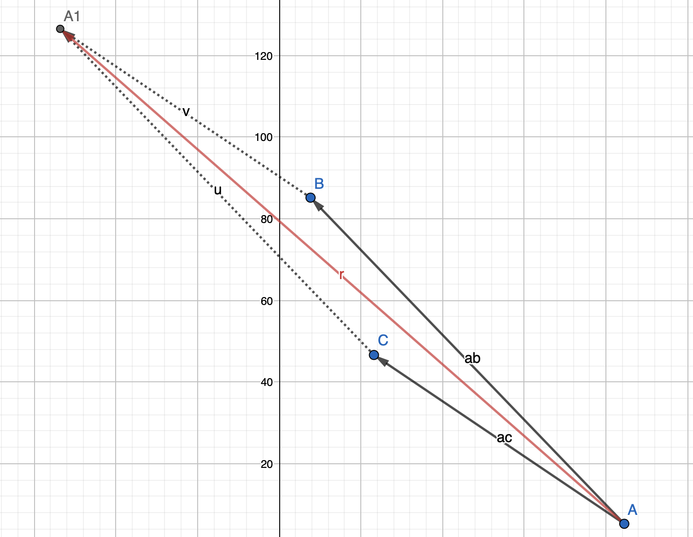

# Assignment 3, due November 16th 2020
Buchauer Manuel, De Sclavis Davide, Handl Philip 

The goal of this assignment is to extend the heat stencil application and measure its performance.

## Exercise 1

This exercise consists in implementing a sequential 2D n-body simulation.

### Tasks

- Provide a sequential implementation of the n-body simulation in 2D. Hints on how to proceed (not mandatory to follow):
	1. generate particles randomly, e.g. uniformly distributed
	2. provide a function for computing forces and moving particles
	3. move particles in a time loop for a given number of steps
- Measure the execution time for various problem sizes. What can you observe?
- Add your best sequential wall time for 10000 particles and 1000 time steps into the comparison spreadsheet linked on Discord.

For the sequential implementation of the n-body simulation in 2D we followed the hints above. The general approach of our implementation is to sum up all the forces applied to a particle. This sum is then used to update the velocity and position of the particle accordingly. To calculate the force between two points we used the formula `force = G * (mass_1 * mass_2) / radius` which was provided in the assignment sheet. However to do so the radius of the previous formula has to be computed first. This was done by simply using the Pythagorean therom. The next step was to calculate the velocity. However we recognized that using the provided formula for the  velocity resulted in all particles moving in the same direction instead of moving towards each other. To solve that problem we calculated the vectors between two points, divided them by their length to get a unit vector and then multiplied it with (force/mass). Therefore our formula looks like this: `velocity = unit_vector * force / mass`. So for multiple particles we also sum the vectors as it can be seen in the figure bellow. The resulting vector is then divided by its length to get the unit vector for the formula.

The last step is then to update the position of the particle by using the provide formula.

## Exercise 2

This exercise consists in investigating and planning optimization and parallelization techniques for Exercise 1.

### Tasks

- Study the nature of the problem in Exercise 1, focusing on its characteristics with regard to optimization and parallelization.
- What optimization methods can you come up with in order to improve the performance of Exercise 1?
- What parallelization strategies would you consider for Exercise 1 and why?

