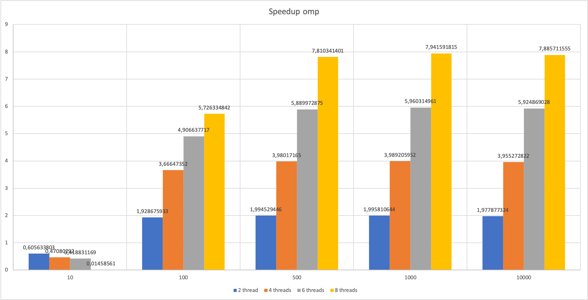
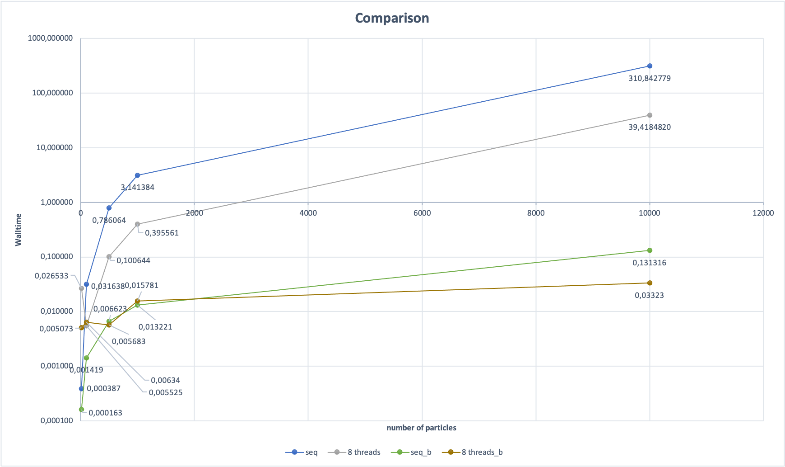
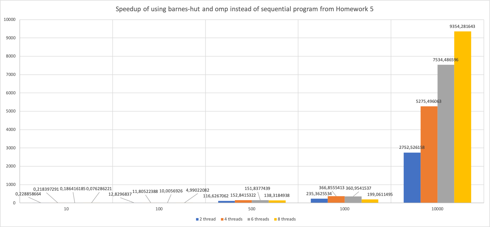

# Assignment 6, due December 07th 2020

Buchauer, De Sclavis, Handl

The goal of this assignment is to implement your parallelization and optimization plan of the n-body simulation of Assignment 5 and experiment with load imbalance.

## Exercise 1

### Tasks

- Provide an OpenMP implementation of your parallelization and optimization plan for the n-body simulation of Assignment 5.

    To parallelize the implementation of Assignment 5 we used a parallel for loop. As optimization strategy we have chosen to implement barnes-hut to gain 
satisfying speedup and bring the complexity from O(n^2) to O(n*log(n)).. To measure the impact of our optimization and parallelization seperately we implemented a sequential barnes-hut version and a parallel one, which was parallelized using OpenMP.  

- Measure the speedup and efficiency for multiple problem and machine sizes as in previous exercises. If your parallelization and optimization are orthogonal code modifications, try to measure the impact of your optimization separately.
- Illustrate the data in appropriate figures and discuss them. What can you observe?

     The first figure bellow visualizes the measured speedup for the sequential nBody 2D program from Assignment 5 and the parallelized version using OpenMP without any optimization. As it can be seen some significant speedup could be achieved however due to the complexity of the problem, a simple parallelization is not sufficient especially for big numbers of particles. 

      

    The second image shows a walltime comparison of the nBody version of Assignment 5 and the optimized barnes hut version. In this image the naive approach of Assignment 5 is marked as "seq" and "8threads" where "seq_b" and "8threads_b" denote the walltimes for the barnes-hut implementation. As it can be seen the barnes hut implementation is significantly faster. 

      

    To show the effect of the barnes-hut optimization compared to the naive version of the nBody implementation, we visualized the speedup of the barnes version in relation to the naive one. While just parallelizing the naive version has a speedup of aproximately 7.9 with 8 threads, the barnes-hut version indicates a speedup of 9354.3.      

    

- Did the implementation meet your expectations from Assignment 5?

    In terms of the parallelization of the naive version from Assignemnt 5, we expected the speedup to fall in the range of the results we achieved, as for example the 8 thread version yields a speedup of approximately 7.9. In terms of parallelization and optimization with barnes-hut, we expected an increase of speedup compared to the normal parallelization of the naive approach, however our expectations were exceeded by the results we achieved. 
    All the provided measurements and some more are provided in the excel spreadsheet of this Assignement.

- Add your best parallel wall time for 8 threads, 10000 particles, and 100 time steps into the comparison spreadsheet linked on Discord.
Our  best performance was achieved with -O3 and -ffast-math. We neededto compile with -O3 because otherwise we have got a segmentation fault on the LCC2. On our local machines it always worked perfectly: 0.033s
With -O2 and without -ffast-math on our local machines the runtime increased from about 0.02s to 0.3s in average.

We did expect that the runtime is improved significantly but such a huge impact was rather a surprise.

## Exercise 2

### Tasks

- Modify your n-body simulation to introduce spatial load imbalance.

We achieved load imbalancing by making sure that every second particle is the left-upper (=north-west) quarter. 

- Try to mitigate your newly introduced load imbalance using any means discussed so far, and measure your efforts.

We have tried out different scheduling strategies: static, dynamic, guided with chunksize 2, 4 and 8.

- Illustrate the data in appropriate figures and discuss them. What can you observe?

The results are provided in the spreadsheet measurements_load_imbalancing.xslx. We did all measurements with 10000 particles and 100 timesteps and 8 threads.
It can be seen, that the static decomposition does not deal that well with load imbalancing. Because we first put every second particle 
in the space [0-50, 0-50], then in the next setup [0-25, 0-25] and then [0-10, 0-10].
With increasing imbalancing the execution time increased from 0.037s up to 0.387s.
The dynamic strategy was worst in all cases but did not vary with increasing imbalancing: about 0.42s
The guided versions worked out the best in all cases. Especially the one with chunksize 8 had constantly a runtime of about 0.05s.

## General Notes

All the material required by the tasks above (e.g. code, figures, etc...) must be part of the solution that is handed in. Your experiments should be reproducible and comparable to your own measurements using the solution materials that you hand in. For source code, please provide a makefile or other, intuitive means of compiling with the required flags and settings.

**Every** member of your group must be able to explain the given problem, your solution, and possible findings. You may also need to answer detailed questions about any of these aspects.

**Please run any benchmarks or heavy CPU loads only on the compute nodes, not on the login node.**
If you want to do some interactive experimentation, use an *interactive job* as outlined in the tutorial. Make sure to stop any interactive jobs once you are done.